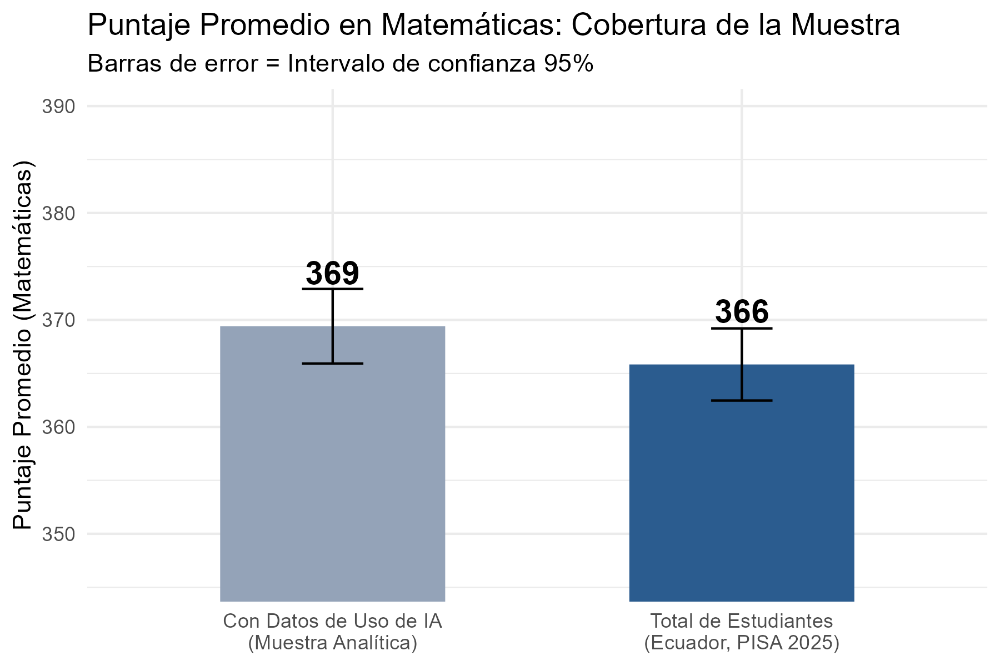
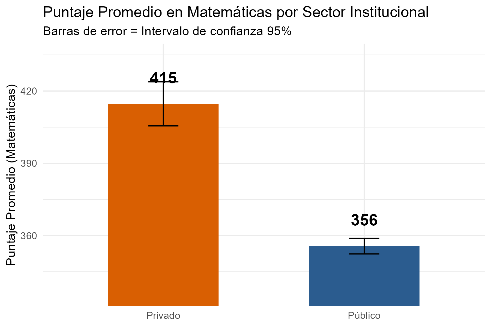
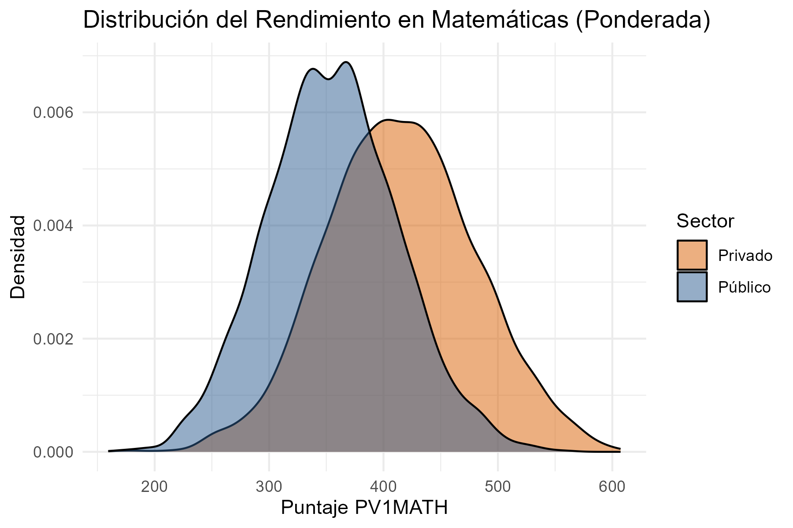
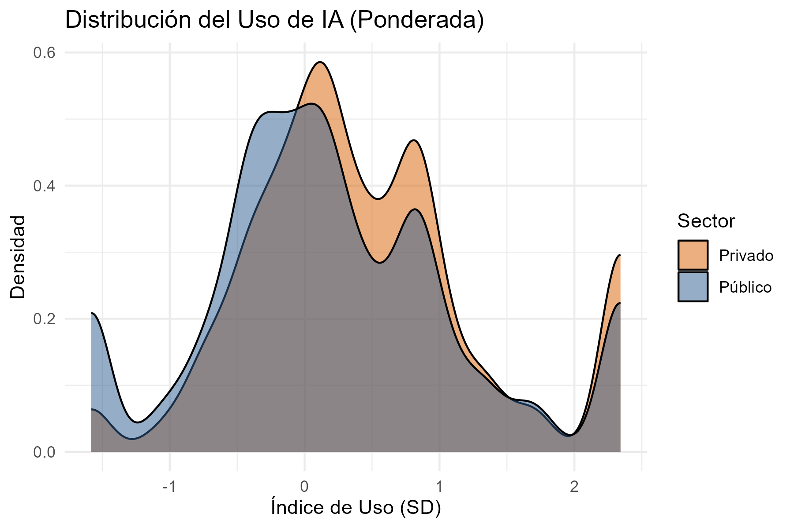
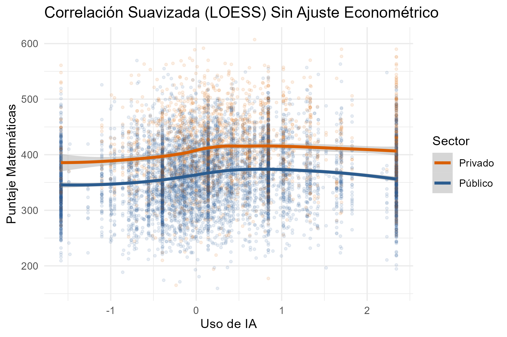
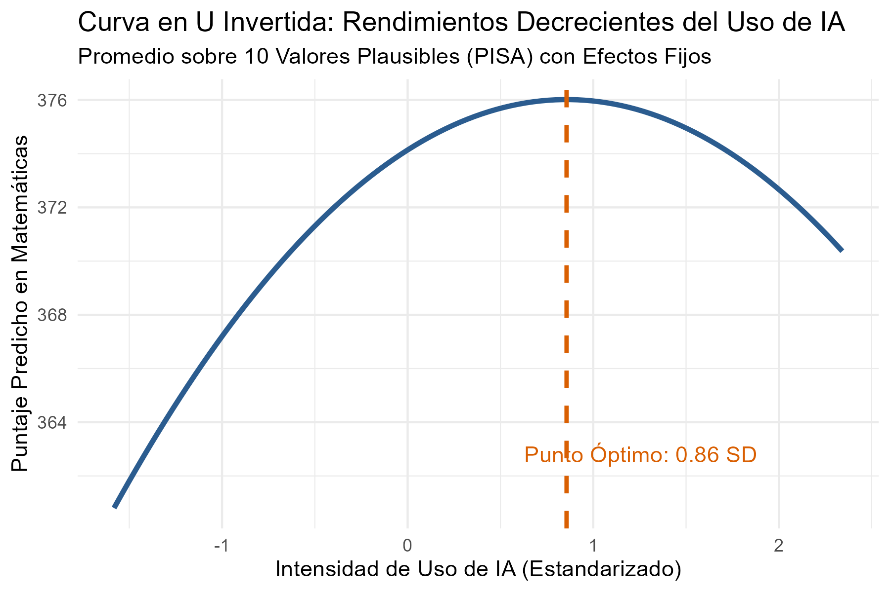
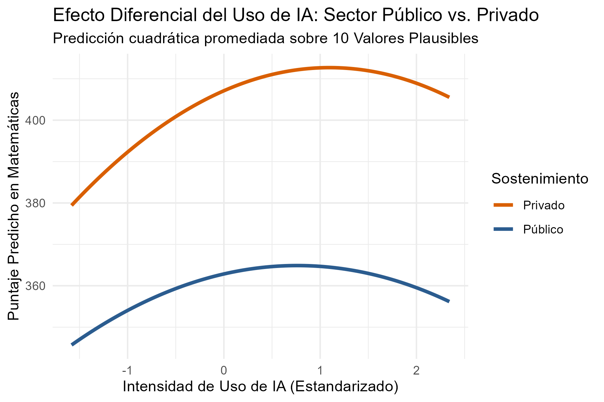

# 🇪🇨 Impacto del Uso de Inteligencia Artificial en el Rendimiento Escolar (PISA 2025)

Análisis econométrico e inferencia causal sobre la relación entre la frecuencia de uso de herramientas de Inteligencia Artificial y el rendimiento en Matemáticas de los estudiantes en Ecuador, evaluando la heterogeneidad entre el sector **público** y **privado**.

---

## 📌 Descripción

A partir del reporte de PISA 2025 de la OCDE, este proyecto evalúa si existe un efecto causal del uso de la Inteligencia Artificial (`AIUSESCH`) sobre los puntajes en Matemáticas de los estudiantes de 15 años en Ecuador.

Metodológicamente, se implementa un modelo de **Efectos Fijos por Institución Educativa** combinado con **Propensity Score Matching (PSM)** sobre los **10 Valores Plausibles (PV1MATH–PV10MATH)**, para testear la presencia de rendimientos decrecientes (curva en U invertida).

El análisis sigue un flujo estándar de ciencia de datos: **Preguntar → Preparar → Procesar/Limpiar → Analizar → Compartir**, documentado paso a paso en el notebook principal.

---

## 📁 Estructura del Repositorio

```text
PISA_IA_Ecuador/
├── .gitignore          <- Ignora los microdatos pesados de PISA
├── LICENSE              <- Licencia del proyecto
├── README.md            <- Documentación del proyecto
├── requirements.txt     <- Dependencias (o renv.lock si gestionas el entorno en R)
├── data/                <- Microdatos crudos de PISA (no incluidos en el repositorio)
├── notebook/
│   └── PISA_2025.qmd    <- Notebook principal en Quarto / R
└── outputs/              <- Gráficos exportados y tablas econométricas
```

> ⚠️ Los archivos de datos no se incluyen en el repositorio por su tamaño (>900 MB). Ver la sección [Fuentes de Datos](#-fuentes-de-datos) para obtenerlos.

---

## 🔍 Metodología

| Paso | Descripción |
|---|---|
| 1. Carga y filtrado | Unificación de las bases de estudiantes (STU) y colegios (SCH), filtradas exclusivamente para Ecuador (`CNT == "ECU"`). |
| 2. Limpieza y variables | Construcción del dataset analítico: sexo, sector institucional (público/privado), cuartiles e índice de uso de IA. |
| 3. Análisis exploratorio | Estadísticas descriptivas, distribución de variables, matriz de correlación y diagnóstico de multicolinealidad (VIF). |
| 4. Control de sesgo (PSM) | Emparejamiento por propensión usando el Estatus Económico, Social y Cultural (`ESCS`) y sexo (`female`) para balancear la muestra. |
| 5. Tratamiento de PVs | Estimación iterativa del modelo cuadrático sobre los 10 Valores Plausibles, promediando coeficientes según las reglas de inferencia de PISA. |
| 6. Efectos fijos | Control por heterogeneidad no observada a nivel de establecimiento educativo (`CNTSCHID`), con errores estándar agrupados (cluster). |
| 7. Heterogeneidad | Análisis desagregado según sostenimiento institucional (público vs. privado). |

---

## 📊 Principales Hallazgos

**Curva en U invertida (efecto general).** Un uso moderado de IA genera retornos positivos en el rendimiento, pero superar el punto óptimo (~0.86 SD) provoca rendimientos decrecientes y caídas en el puntaje.

**Heterogeneidad por sector (público vs. privado).** Los estudiantes de colegios privados experimentan un beneficio marginal inicial más alto ante el uso moderado de IA, aunque ambos sectores muestran un declive al incurrir en un uso excesivo.

---

## 📈 Visualizaciones Clave

### Cobertura de la muestra


El puntaje promedio de los estudiantes que reportaron su uso de IA (369) es apenas superior al promedio nacional (366), y sus intervalos de confianza se solapan casi por completo. Esto indica que la muestra analítica **no está sesgada de forma relevante** frente a la población general — filtrar por quienes respondieron la pregunta de uso de IA no distorsiona significativamente el punto de partida del análisis.

### Rendimiento por sector institucional


Aquí sí aparece una brecha clara: 415 puntos en colegios privados frente a 356 en públicos, con intervalos de confianza que **no se solapan**. La diferencia es estadísticamente significativa — el sector institucional está fuertemente asociado al rendimiento en matemáticas.

### Distribución del rendimiento


La curva del sector privado está desplazada hacia la derecha respecto al público, confirmando visualmente la brecha del gráfico anterior. El sector público muestra una distribución más concentrada entre 250 y 450 puntos, mientras que el privado tiene una cola más larga hacia puntajes altos (hasta ~600).

### Distribución del uso de IA


Ambos sectores muestran una forma de distribución similar, con la mayor concentración de estudiantes entre -0.5 y 1 SD de uso. El sector privado tiene una densidad algo mayor en el rango medio-alto (0.5–1 SD), sugiriendo un uso ligeramente más intensivo de herramientas de IA que en el sector público.

### Relación exploratoria entre uso de IA y rendimiento


Sin ningún ajuste econométrico, ya se observan dos patrones: (1) la curva de colegios privados está consistentemente por encima de la de públicos en todo el rango de uso de IA, y (2) ambas curvas suben con el uso moderado y se aplanan o retroceden levemente en niveles altos de uso — una primera señal visual de la no linealidad que se confirma más adelante con el modelo formal.

### Curva en U invertida (efecto general)


Con el modelo cuadrático de efectos fijos, se confirma la hipótesis inicial: el rendimiento predicho sube con el uso de IA hasta un punto óptimo de **0.86 SD**, después del cual comienzan los rendimientos decrecientes. El efecto no es enorme en magnitud (varía entre ~360 y 376 puntos a lo largo de toda la curva), pero sigue el patrón esperado.

### Curva en U invertida por sector


Separando por sector, ambas curvas mantienen la misma forma de U invertida, pero en niveles distintos: el sector privado se mueve entre ~380 y ~420 puntos, con su punto óptimo alrededor de 1 SD de uso; el público se mueve entre ~345 y ~368 puntos, con su punto óptimo un poco antes, cerca de 0.7–0.8 SD. Es decir, los estudiantes privados no solo parten de un nivel más alto, sino que también toleran un poco más de uso de IA antes de que aparezcan los rendimientos decrecientes.

---

## 📋 Fuentes de Datos

| Dataset | Fuente | Archivo |
|---|---|---|
| PISA 2025 – Student Questionnaire | [OECD PISA Database](https://www.oecd.org/pisa/data/) | `CY09_MS_STU_PUF.sav` |
| PISA 2025 – School Questionnaire | [OECD PISA Database](https://www.oecd.org/pisa/data/) | `CY09_MS_SCH_PUF.sav` |

---

## ⚙️ Instalación y Replicabilidad

```bash
# 1. Clonar el repositorio
git clone https://github.com/tu-usuario/PISA_IA_Ecuador.git
cd PISA_IA_Ecuador

# 2. Descargar las bases de datos de PISA 2025 en formato SPSS (.sav)
#    y colocarlas dentro de la carpeta local /data

# 3. Abrir RStudio / VS Code y renderizar el documento Quarto
quarto render notebook/PISA_2025.qmd
```

---

## 📦 Dependencias (R)

| Paquete | Uso |
|---|---|
| `tidyverse` | Manipulación y visualización de datos |
| `haven` | Lectura de archivos SPSS (`.sav`) |
| `fixest` | Estimación de modelos de regresión con efectos fijos |
| `MatchIt` | Emparejamiento por Propensity Score Matching |
| `car` | Diagnóstico de multicolinealidad (VIF) |
| `lmtest` / `sandwich` | Inferencia robusta y errores estándar |
| `intsvy` | Manejo de valores plausibles y pesos muestrales de PISA |
| `modelsummary` / `kableExtra` | Tablas de regresión y formato |
| `patchwork` | Combinar múltiples gráficos de `ggplot2` |

---

## ⚠️ Limitaciones

- La muestra corresponde a cortes transversales repetidos de PISA; no permite seguimiento a nivel de panel del mismo individuo.
- La variable de uso de IA (`AIUSESCH`) se basa en el autoreporte del estudiante en el cuestionario de contexto, por lo que puede estar sujeta a sesgos de memoria o deseabilidad social.
- El PSM balancea por `ESCS` y sexo, pero no puede descartar sesgo por variables no observadas (por ejemplo, motivación o acceso previo a tecnología).

---

## 📄 Licencia

Este proyecto se distribuye bajo licencia **MIT**. Ver [`LICENSE`](./LICENSE) para más detalles.
